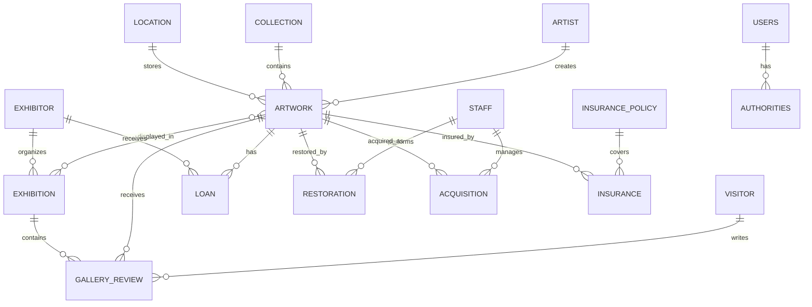
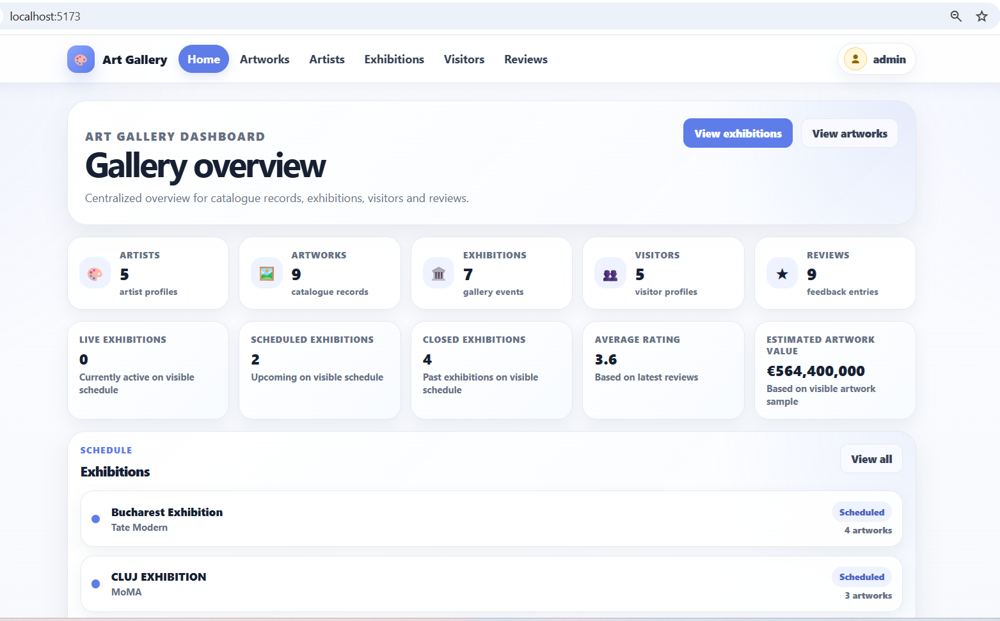
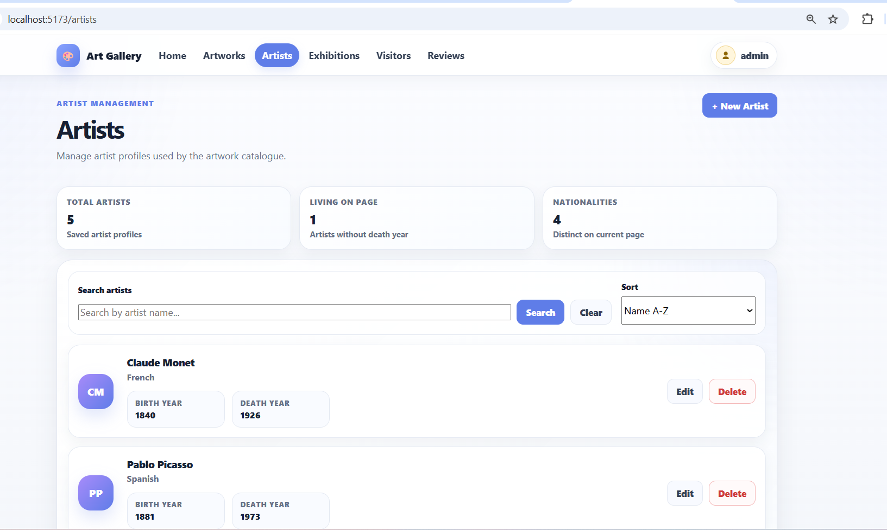
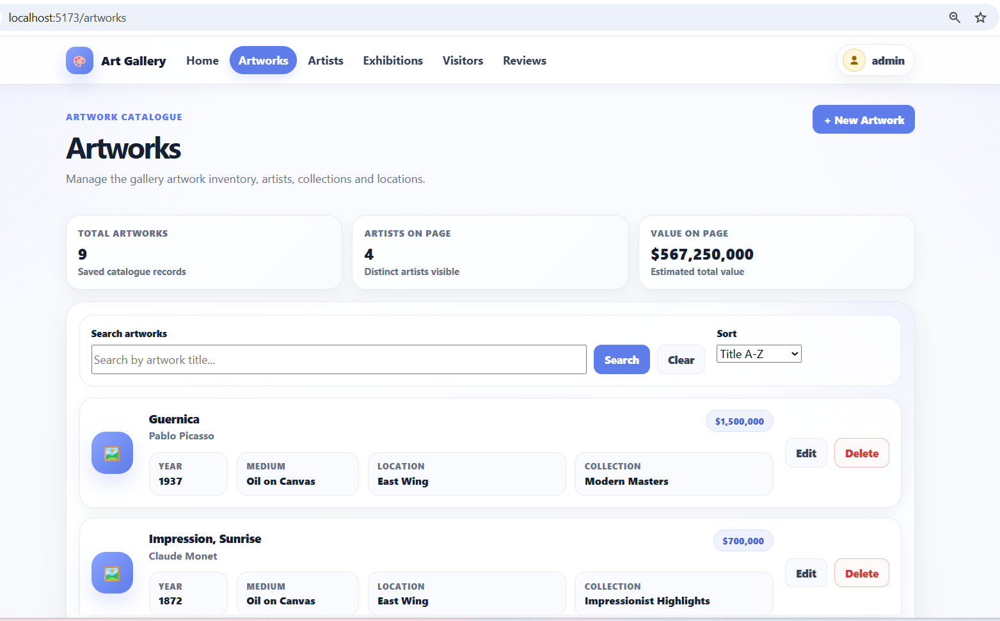
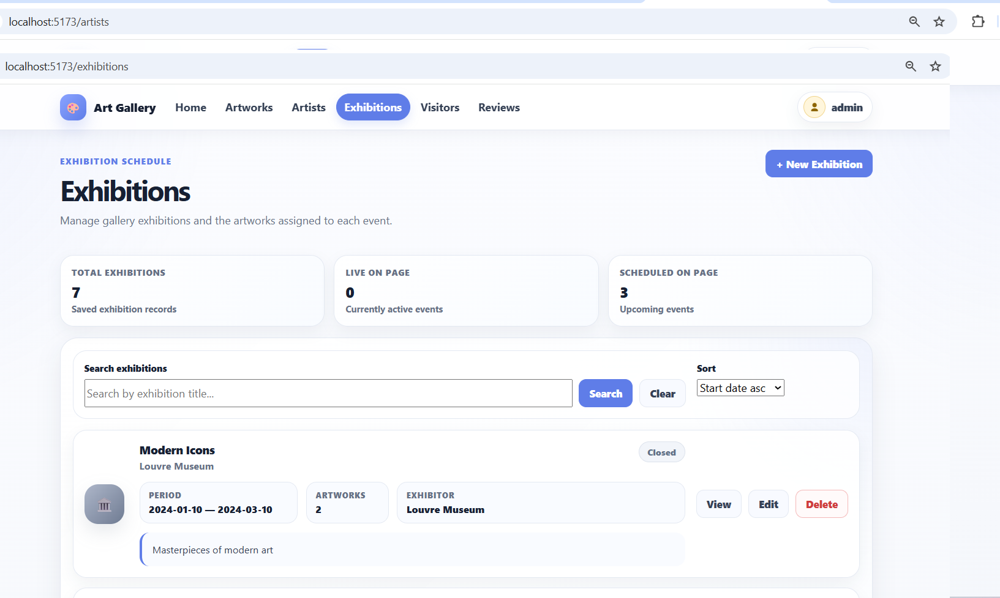
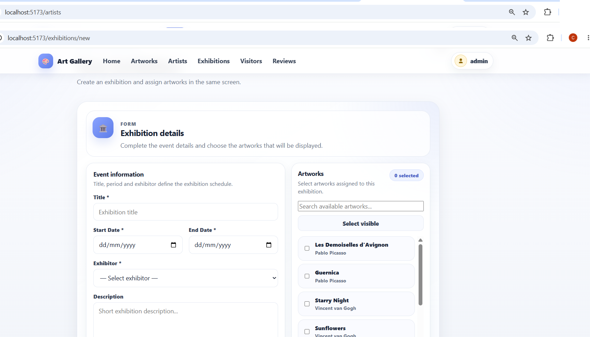
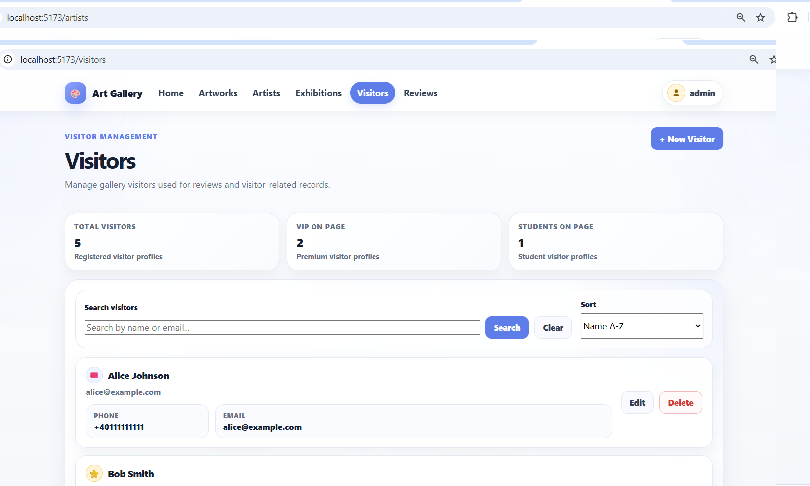
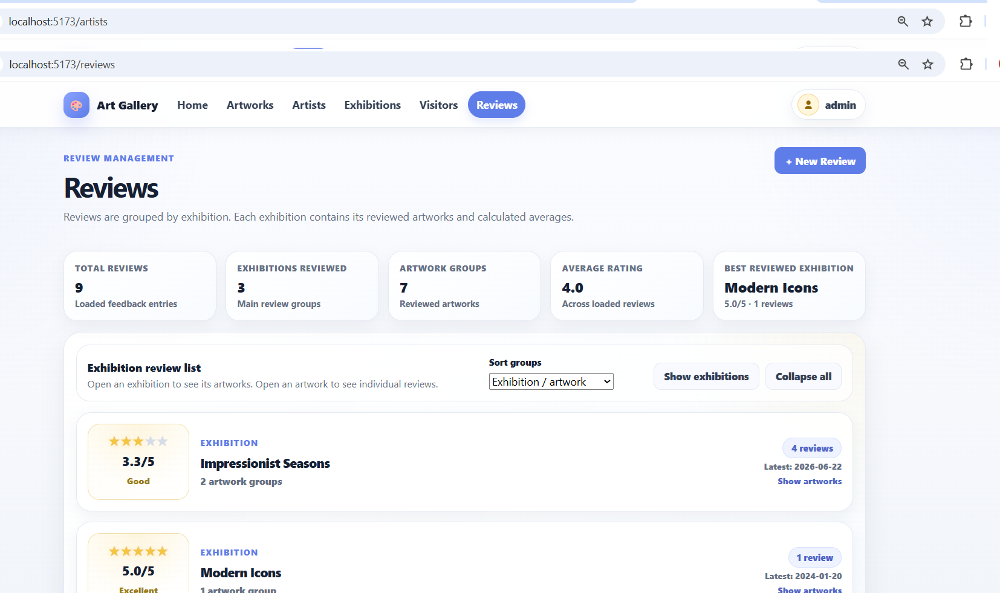

# Art Gallery Management System

Aplicație web pentru administrarea unei galerii de artă.
Proiectul are o arhitectură full-stack cu backend Spring Boot, frontend Vue 3, autentificare pe bază de roluri și bază de date PostgreSQL.
Aplicația este disponibilă online prin Vercel, Render și Neon PostgreSQL.

---
## Cuprins

- [Linkuri proiect](#linkuri-proiect) 
- [Descriere proiect](#descriere-proiect)
- [Cerințe implementate - PCT I](#cerințe-implementate---pct-i)
- [Tehnologii folosite](#tehnologii-folosite)
- [Arhitectură aplicație](#arhitectură-aplicație)
- [Deployment](#deployment)
- [Model de date](#model-de-date)
- [Diagramă ER](#diagramă-er)
- [Baza de date](#baza-de-date)
- [Securitate](#securitate)
- [Documentație API](#documentație-api)
- [Rulare locală](#rulare-locală)
- [Testare backend](#testare-backend)
- [Build frontend](#build-frontend)
- [Capturi de ecran](#capturi-de-ecran)
- [Structura proiectului](#structura-proiectului)
- [Contribuții](#contribuții)

---

## Linkuri proiect

| Resursă | Link |
|---|---|
| Frontend online - Vercel | [https://awbd-deploy-hd22iz59o-catalinmarza29-2853s-projects.vercel.app](https://awbd-deploy-hd22iz59o-catalinmarza29-2853s-projects.vercel.app) pw admin=AdminGallery2026! user=UserGallery2026!|
| Backend online - Render | [https://art-gallery-backend-agdm.onrender.com](https://art-gallery-backend-agdm.onrender.com) |
| API online | [https://art-gallery-backend-agdm.onrender.com/api](https://art-gallery-backend-agdm.onrender.com/api) |
| Repository echipă | [https://github.com/lucalovin/awbd](https://github.com/lucalovin/awbd) |
| Repository folosit pentru deploy | [https://github.com/CatalinMarza/awbd-deploy](https://github.com/CatalinMarza/awbd-deploy) |

> Observație: repository-ul de deploy a fost folosit pentru configurarea rapidă a serviciilor Vercel și Render. Codul proiectului rămâne sincronizat cu repository-ul echipei.

---

## Descriere proiect

**Art Gallery Management System** este o aplicație pentru gestionarea activităților unei galerii de artă.

Aplicația permite administrarea următoarelor elemente:
- artiști;
- lucrări de artă;
- locații;
- expoziții;
- expozanți;
- vizitatori;
- review-uri;

Aplicația are două tipuri principale de utilizatori:

- **ADMIN** - poate adăuga, edita, șterge și vizualiza datele aplicației;
- **USER** - poate accesa aplicația în mod read-only, pentru vizualizarea informațiilor disponibile.

---

## Cerințe implementate

### 1. Model de date

Aplicația conține mai mult de 6 entități interconectate.

Entități principale:
- Artist;
- Artwork;
- Collection;
- Location;
- Exhibition;
- Exhibitor;
- Visitor;
- GalleryReview;
- Loan;
- Restoration;
- Acquisition;
- Staff;
- Insurance;
- InsurancePolicy.

Tipuri de relații implementate:
| Tip relație | Exemplu |
|---|---|
| `@OneToOne` | Artwork - Insurance / InsurancePolicy |
| `@OneToMany / @ManyToOne` | Artist - Artwork |
| `@OneToMany / @ManyToOne` | Collection - Artwork |
| `@OneToMany / @ManyToOne` | Location - Artwork |
| `@OneToMany / @ManyToOne` | Visitor - GalleryReview |
| `@OneToMany / @ManyToOne` | Staff - Restoration |
| `@ManyToMany` | Artwork - Exhibition |

---
### 2. Operații CRUD complete
Aplicația implementează operații CRUD pentru entitățile principale.
Funcționalități:
- creare înregistrări;
- afișare înregistrări;
- actualizare înregistrări;
- ștergere înregistrări;
- căutare;
- paginare;
- sortare.

Backend-ul este structurat pe layere:
- Controller;
- Service;
- Repository;
- Model;
- DTO;
- Exception handling.

---

### 3. Configurare multi-environment
Aplicația folosește profiluri Spring separate:
- `dev` - pentru dezvoltare locală cu PostgreSQL în Docker;
- `test` - pentru rularea testelor automate;
- `prod` - pentru deployment online pe Render cu bază de date Neon PostgreSQL.

Fișiere relevante:
```text
art-gallery-spring-backend/src/main/resources/application-dev.yml
art-gallery-spring-backend/src/test/resources/application-test.yml
art-gallery-spring-backend/src/main/resources/application-prod.yml
```

---
### 4. Testing
Backend-ul include teste automate pentru layer-ul de service și funcționalitățile principale.
Tehnologii folosite:
- JUnit 5;
- Mockito;
- Spring Boot Test;
- JaCoCo.

Rezultatul testelor la momentul documentării:

```text
Tests run: 123
Failures: 0
Errors: 0
Skipped: 0
BUILD SUCCESS
```

---
### 5. Views și validare
Frontend-ul este implementat în Vue 3 și oferă interfață pentru:
- autentificare;
- dashboard;
- listare entități;
- formulare de adăugare/editare;
- detalii expoziție;
- paginare și sortare;
- mesaje de eroare;
- acces diferențiat în funcție de rol.

Validarea este realizată atât în backend, prin validări pe entități și DTO-uri, cât și în frontend, prin verificarea datelor introduse în formulare.

---
### 6. Logging
Backend-ul folosește mecanismul de logging din Spring Boot, bazat pe SLF4J și Logback.
Logging-ul este utilizat pentru urmărirea operațiilor importante și pentru diagnosticarea erorilor.

---

### 7. Paginare și sortare
Paginarea și sortarea sunt disponibile pentru mai multe entități.
Exemple:
- Artworks;
- Artists;
- Exhibitions;
- Visitors;
- Reviews.

Frontend-ul include:
- controale de paginare;
- sortare pe coloane;
- câmpuri de căutare;
- afișarea datelor în tabele.

---

### 8. Spring Security

Aplicația include autentificare și autorizare cu Spring Security.
Funcționalități implementate:
- autentificare JDBC;
- utilizatori salvați în tabela `users`;
- roluri salvate în tabela `authorities`;
- parole hash-uite cu BCrypt;
- pagină custom de login;
- logout;
- sesiune autentificată;
- roluri `ADMIN` și `USER`;
- protejarea endpoint-urilor în funcție de rol;
- protejarea acțiunilor de creare, editare și ștergere pentru utilizatorii non-admin.

---

## Tehnologii folosite

### Backend

- Java 17;
- Spring Boot;
- Spring Data JPA;
- Spring Security;
- Bean Validation;
- PostgreSQL;
- Maven;
- JUnit 5;
- Mockito;
- JaCoCo;
- Docker;
- Render.

### Frontend

- Vue 3;
- Vite;
- Vue Router;
- Pinia;
- JavaScript;
- CSS;
- Vercel.

### Bază de date

- PostgreSQL local în Docker pentru dezvoltare;
- Neon PostgreSQL pentru producție/deployment online.

---

## Arhitectură aplicație

Aplicația este structurată ca o aplicație full-stack.
```text
Vue 3 Frontend - Vercel
        |
        | HTTPS / REST API
        v
Spring Boot Backend - Render
        |
        | Spring Data JPA / JDBC
        v
PostgreSQL Database - Neon
```

Structura backend-ului:

```text
Controller Layer
        |
Service Layer
        |
Repository Layer
        |
Database
```

Structura frontend-ului:

```text
Views
Components
Router
Stores
API Resources
CSS
```

---

## Deployment

Aplicația este deployată online folosind:
- **Vercel** pentru frontend-ul Vue 3;
- **Render** pentru backend-ul Spring Boot;
- **Neon PostgreSQL** pentru baza de date online.

### Frontend - Vercel

Configurare Vercel:
```text
Framework Preset: Vite
Root Directory: art-gallery-spring-frontend
Build Command: npm run build
Output Directory: dist
Install Command: npm install
```

Variabilă de mediu Vercel:
```text
VITE_API_BASE_URL=https://art-gallery-backend-agdm.onrender.com/api
```
Pentru a evita eroarea `404 Not Found` la refresh pe rutele Vue, aplicația folosește fișierul:
```text
art-gallery-spring-frontend/vercel.json
```
cu regula de rewrite către `index.html`.

---

### Backend - Render

Configurare Render:
```text
Runtime: Docker
Root Directory: art-gallery-spring-backend
Dockerfile Path: ./Dockerfile
Branch: main
```

Variabile de mediu Render:
```text
SPRING_PROFILES_ACTIVE=prod
SPRING_DATASOURCE_URL=jdbc:postgresql://<NEON_HOST>/<DATABASE>?sslmode=require
SPRING_DATASOURCE_USERNAME=<NEON_USERNAME>
SPRING_DATASOURCE_PASSWORD=<NEON_PASSWORD>
APP_CORS_ALLOWED_ORIGINS=http://localhost:5173,https://*.vercel.app
```

Valorile sensibile nu sunt publicate în repository.
Backend-ul expune API-ul la:

```text
https://art-gallery-backend-agdm.onrender.com/api
```

---

### Baza de date - Neon PostgreSQL

Baza de date online este găzduită pe Neon PostgreSQL.
Schema este generată de Hibernate/JPA la pornirea aplicației cu profilul `prod`.
Tabele principale în producție:
- `artist`;
- `artwork`;
- `artwork_exhibition`;
- `collection`;
- `exhibition`;
- `exhibitor`;
- `gallery_review`;
- `insurance`;
- `insurance_policy`;
- `loan`;
- `location`;
- `restoration`;
- `staff`;
- `visitor`;
- `users`;
- `authorities`.

---

## Model de date

Modelul de date este construit în jurul domeniului unei galerii de artă.
Descriere entități:
- `Artist` - reține informații despre artiști;
- `Artwork` - reține informații despre lucrările de artă;
- `Collection` - reține colecții tematice de lucrări;
- `Location` - reține locațiile galeriei;
- `Exhibition` - reține informații despre expoziții;
- `Exhibitor` - reține date despre organizatorii sau partenerii expozițiilor;
- `Visitor` - reține informații despre vizitatori;
- `GalleryReview` - reține feedback-ul vizitatorilor;
- `Loan` - reține informații despre împrumuturi;
- `Restoration` - reține lucrările de restaurare;
- `Acquisition` - reține date despre achizițiile de lucrări;
- `Staff` - reține informații despre angajați;
- `Insurance` și `InsurancePolicy` - rețin informații despre asigurarea lucrărilor.

---

## Diagramă ER



---

## Baza de date

### Dezvoltare locală

Aplicația folosește PostgreSQL local, pornit prin Docker Compose.
Configurare locală:

```text
SGBD: PostgreSQL
Database: artgallery
Username: artgallery
Password: artgallery
Port: 5432
Host: localhost
```

Pornire bază de date locală:
```bash
cd art-gallery-spring-backend
docker compose up -d
```

Verificare container:
``bash
docker ps
```

---

### Producție online

În producție, baza de date este Neon PostgreSQL.
Aplicația Render se conectează la Neon prin variabile de mediu:

```text
SPRING_DATASOURCE_URL
SPRING_DATASOURCE_USERNAME
SPRING_DATASOURCE_PASSWORD
```

Datele demo au fost introduse în Neon pentru prezentarea aplicației online.

---

## Securitate

Aplicația are două roluri principale:
| Rol | Permisiuni |
|---|---|
| ADMIN | Poate crea, edita, șterge și vizualiza date |
| USER | Poate vizualiza date, fără operații administrative |

Funcționalități de securitate:
- login custom;
- logout;
- autentificare JDBC;
- parole BCrypt;
- endpoint-uri protejate;
- acces diferențiat pe roluri;
- ascunderea acțiunilor administrative în frontend pentru utilizatorii non-admin;
- CORS configurat pentru frontend-ul Vercel.

Conturi demo online:
| Rol | Username | Password |
|---|---|---|
| ADMIN | `admin` | `AdminGallery2026!` |
| USER | `user` | `UserGallery2026!` |

---

## Documentație API
URL backend online:
```text
https://art-gallery-backend-agdm.onrender.com
```
URL API online:

```text
https://art-gallery-backend-agdm.onrender.com/api
```

### Authentication

| Metodă | Endpoint | Descriere |
|---|---|---|
| POST | `/api/auth/login` | Autentificare |
| POST | `/api/auth/logout` | Logout |
| GET | `/api/auth/me` | Utilizatorul autentificat curent |

---

### Artists

| Metodă | Endpoint | Descriere |
|---|---|---|
| GET | `/api/artists` | Listare artiști |
| GET | `/api/artists/{id}` | Detalii artist |
| POST | `/api/artists` | Creare artist |
| PUT | `/api/artists/{id}` | Actualizare artist |
| DELETE | `/api/artists/{id}` | Ștergere artist |
| GET | `/api/artists/search` | Căutare artiști |

---

### Artworks

| Metodă | Endpoint | Descriere |
|---|---|---|
| GET | `/api/artworks` | Listare lucrări de artă |
| GET | `/api/artworks/{id}` | Detalii lucrare |
| POST | `/api/artworks` | Creare lucrare |
| PUT | `/api/artworks/{id}` | Actualizare lucrare |
| DELETE | `/api/artworks/{id}` | Ștergere lucrare |
| GET | `/api/artworks/search` | Căutare lucrări |

---

### Exhibitions

| Metodă | Endpoint | Descriere |
|---|---|---|
| GET | `/api/exhibitions` | Listare expoziții |
| GET | `/api/exhibitions/{id}` | Detalii expoziție |
| POST | `/api/exhibitions` | Creare expoziție |
| PUT | `/api/exhibitions/{id}` | Actualizare expoziție |
| DELETE | `/api/exhibitions/{id}` | Ștergere expoziție |
| GET | `/api/exhibitions/search` | Căutare expoziții |

---

### Exhibition Artworks

| Metodă | Endpoint | Descriere |
|---|---|---|
| GET | `/api/exhibitions/{id}/artworks` | Lucrări asociate unei expoziții |
| POST | `/api/exhibitions/{id}/artworks/{artworkId}` | Adăugare lucrare în expoziție |
| DELETE | `/api/exhibitions/{id}/artworks/{artworkId}` | Eliminare lucrare din expoziție |

---

### Visitors

| Metodă | Endpoint | Descriere |
|---|---|---|
| GET | `/api/visitors` | Listare vizitatori |
| GET | `/api/visitors/{id}` | Detalii vizitator |
| POST | `/api/visitors` | Creare vizitator |
| PUT | `/api/visitors/{id}` | Actualizare vizitator |
| DELETE | `/api/visitors/{id}` | Ștergere vizitator |
| GET | `/api/visitors/search` | Căutare vizitatori |

---

### Reviews

| Metodă | Endpoint | Descriere |
|---|---|---|
| GET | `/api/reviews` | Listare review-uri |
| GET | `/api/reviews/{id}` | Detalii review |
| POST | `/api/reviews` | Creare review |
| PUT | `/api/reviews/{id}` | Actualizare review |
| DELETE | `/api/reviews/{id}` | Ștergere review |
| GET | `/api/reviews/search` | Căutare review-uri |

---

## Rulare locală

### Cerințe preliminare

Trebuie instalate:

- Git;
- Java 17;
- Maven;
- Node.js;
- npm;
- Docker Desktop;
- pgAdmin 4, opțional, pentru vizualizarea bazei de date locale.

---

### 1. Clonare repository

```bash
git clone https://github.com/lucalovin/awbd.git
cd awbd
```

---

### 2. Pornire bază de date locală

```bash
cd art-gallery-spring-backend
docker compose up -d
```

---

### 3. Pornire backend local

```bash
cd art-gallery-spring-backend
mvn spring-boot:run -Dspring-boot.run.profiles=dev
```
Backend-ul local rulează la:

```text
http://localhost:8080
```

---

### 4. Pornire frontend local

Într-un terminal separat:

```bash
cd art-gallery-spring-frontend
npm install
npm run dev
```
Frontend-ul local rulează la:

```text
http://localhost:5173
```

---

## Testare backend

Pentru rularea testelor backend:
```bash
cd art-gallery-spring-backend
mvn test
```

Rezultat documentat:
```text
Tests run: 123
Failures: 0
Errors: 0
Skipped: 0
BUILD SUCCESS
```

Testele generează și raport JaCoCo.

---

## Build frontend

Pentru verificarea build-ului frontend:
```bash
cd art-gallery-spring-frontend
npm run build
```

---

## Capturi de ecran

### Login


---

### Dashboard



---

### Artiști



---

### Lucrări de artă



---

### Expoziții



---

### Detalii expoziție


---

### Formular expoziție



---

### Vizitatori



---

### Review-uri



---

### Container Docker pentru baza de date locală


---

### Tabelele bazei de date în pgAdmin


---

### Teste backend


---

## Structura proiectului

```text
awbd
├── art-gallery-spring-backend
│   ├── src
│   │   ├── main
│   │   │   ├── java
│   │   │   │   └── com
│   │   │   │       └── artgallery
│   │   │   │           ├── config
│   │   │   │           ├── controller
│   │   │   │           ├── dto
│   │   │   │           ├── exception
│   │   │   │           ├── model
│   │   │   │           ├── repository
│   │   │   │           ├── security
│   │   │   │           └── service
│   │   │   └── resources
│   │   └── test
│   ├── Dockerfile
│   ├── docker-compose.yml
│   └── pom.xml
│
├── art-gallery-spring-frontend
│   ├── src
│   │   ├── api
│   │   ├── components
│   │   ├── router
│   │   ├── stores
│   │   ├── views
│   │   ├── App.vue
│   │   ├── main.js
│   │   └── styles.css
│   ├── vercel.json
│   ├── package.json
│   └── vite.config.js
│
├── screenshots
│   └── *.png
│
└── README.md
```

---

## Git workflow

Strategie recomandată:

```text
main
dev
feature/*
deploy-config
```

Comenzi uzuale:

```bash
git status
git add .
git commit -m "Descriere modificare"
git push
```

---

## Contribuții

| Nume | Contribuție |
|---|---|
| Cătălin Marza | Implementare frontend Vue 3, pagini și componente UI, formulare CRUD, integrare cu API-ul backend, afișare tabele cu paginare/sortare/căutare, integrare roluri în interfață, configurare deployment Vercel/Render, capturi de ecran și documentație README |
| Luca Lovin | Implementare backend Spring Boot, model de date JPA, repository pattern, service layer, controllere REST, configurare PostgreSQL/Docker, Spring Security, validare backend, logging și teste automate |
| Cătălin Marza & Luca Lovin | Definirea domeniului aplicației, relațiile dintre entități, integrarea frontend-backend, verificarea cerințelor PCT I, rularea testelor și pregătirea proiectului pentru prezentare |

---

## Observații
```text
Deployment-ul online este disponibil prin Vercel, Render și Neon PostgreSQL.
Backend-ul este publicat pe Render Free Tier. După perioade de inactivitate, Render poate opri temporar serviciul, iar primul request poate avea o întârziere până când serverul repornește. Frontend-ul Vue verifică autentificarea la pornire prin endpoint-ul `/api/auth/me`, deci această întârziere poate apărea ca `Loading application...`.
După ce serverul Render este activ, aplicația se încarcă normal.
Dacă pagina rămâne temporar în starea `Loading application...`, se poate verifica direct backend-ul accesând linkul API-ului Render sau pagina serviciului din Render Dashboard.
Backend-ul Render nu are pagină HTML la ruta principală `/`. Pentru verificarea pornirii serverului se poate accesa endpoint-ul: [https://art-gallery-backend-agdm.onrender.com/api/auth/me](https://art-gallery-backend-agdm.onrender.com/api/auth/me)
Un răspuns `401 Unauthorized` este normal și indică faptul că serverul este pornit, dar utilizatorul nu este autentificat.

```
